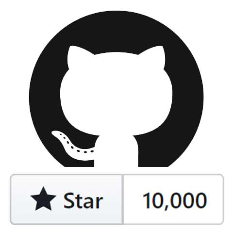

@zhigamovsky/styled-console-log

## **Installation**
```npm install @zhigamovsky/styled-console-log```
### Import
```javascript
import Log from '@zhigamovsky/styled-console-log'
```

### Just for example I define dummy variables 
```javascript
let a = { key: 'value', value: 'value', k: 2 };
let c = 2;
let dummy = { a, b: ['value', 'value', 'value'], c, d: 'asdasdsad', l: { } };
```


## Simple usage
### **1. Log with different ready-made templates**

```javascript
Log.error('Oh, god damn!', c, a, dummy); 
Log.warn('Warn you about a warning!', c, a, dummy);
Log.success('Got it!', c, a, dummy);
Log.dark('Devil within, boo-ga-ga', c, a, dummy);
Log.light('Angel within', c, a, dummy);
Log.info('Lorem ipsum dolor... As trivially as this message', c, a, dummy);
```


### **2. Yes! You can display any image in console**

```javascript
Log.image('https://download.seaicons.com/download/i45781/tatice/cristal-intense/tatice-cristal-intense-apple-grey.ico');
```


### **2.1 Also you can configuring size image in console**
### For configuring logging your need to import `log` (not `Log`)

```javascript
import { log } from '@zhigamovsky/styled-console-log'

log.image('https://upload.wikimedia.org/wikipedia/commons/thumb/8/82/SARS-CoV-2_without_background.png/1020px-SARS-CoV-2_without_background.png')({
  background: 'red',  
  height: 150, 
  width: 150
});
```


### **3. Of course you can display any gif file. Yes, GIFs are animated**
### By default gif has 100x100. For configuring logging your need to import `log` (not `Log`).

```javascript
import Log, { log } from '@zhigamovsky/styled-console-log'

log.gif('https://media2.giphy.com/media/S2vSPMhKtLp9I6VMDY/giphy.gif')({
  background: '#435444',  
  height: 250, 
  width: 250
});
Log.gif('https://media2.giphy.com/media/S2vSPMhKtLp9I6VMDY/giphy.gif');
```


### **4. Override ready-made template Styles and Icons**
### Of course, you can override any **Styles** or **Icons**  of the templates as you like.
### Instead of `Types.warn` you can use just `'warn'`, but I Strongly recommended use `Types`
```javascript
import Log, { Types } from '@zhigamovsky/styled-console-log' 

Log.warn('Warn Template before overriding styles and icon...', c, a, dummy);

Log.overrideStyles(Types.warn, 'background: #353535; color: pink; border-style: dash; border-width: 2px;');
Log.overrideIcons(Types.warn, '⚠️');

Log.warn('Warn Template after overriding styles and icon...', c, a, dummy);
```


### **5. Divider like sense of life**

### Just useful features for divided porridge from the code in real project. Divider use `background-color` and `border` from his template. If
### By default `Log.divided()` use `'info'` template. 
### Instead of `Types.warn | Types.error | etc... ` you can use just `'warn'`, `'error'`, but I Strongly recommended use `Types`
```javascript
import Log, { Types } from '@zhigamovsky/styled-console-log'

Log.divided();
Log.divided(Types.error);
Log.divided(Types.warn);
Log.divided(Types.success);
Log.divided(Types.light);
Log.divided(Types.dark);
```


### **5.1 Overriding make sense**

### If you are override some template, template's divider alse change style to according to new css rules
### `Log.overrideStyles(type: string, styles: inlineCss)`
```javascript
import Log, { Types } from '@zhigamovsky/styled-console-log'

Log.divided(Types.warn);
Log.warn('Warn Template before overriding styles and icon...', c, a, dummy);
Log.overrideStyles(Types.warn, 'background: #353535; color: pink; border-style: dash; border-width: 2px;');
Log.overrideIcons(Types.warn, '⚠️')
Log.warn('Warn Template after overriding styles and icon...', c, a, dummy);
Log.divided(Types.warn);
```


### **6. Create and add own template**

### If you are not enough ready-made templates, you can create and add your own
### After creation you can use Log with new  template. Divider also works!
### Do not be afraid to experiment!
### `addOwnTemplate(identifier: string)(icon: string)(styles: inlineCss)`
```javascript
import Log, { Types } from '@zhigamovsky/styled-console-log'

Log.addOwnTemplate('jolly')('🦠')('color: lightgreen; padding: 3px; border: 2px solid lightgreen; background: #353535; font-weight: 800;');

Log.jolly('Some text to your own custom template :)', dummy, c, a);
Log.divided(Types.jolly);
```


### **7. Environments**
### The most important thing for me is the environment.
### Now are available two environments. `Release` and `Debug`.
### I know well how console.log loads the browser, so I made a release environment. So you can set `Debug`, all of console.log with `Log` or `log` are shown. But if you set up `Release` - all of console.log will be hidden without the need to remove them in code. And you can return to debugging at any time without restoring all the logs.
```javascript
Log.setEnvironmentDebug();
Log.setEnvironmentRelease();
```

# If `@zhigamovsky/styled-console-log` helped you, give me a star on GitHub


# This package is under development. Subscribe to updates if you're interested. Thank you for understanding. I will add many many new features. Good Coding!